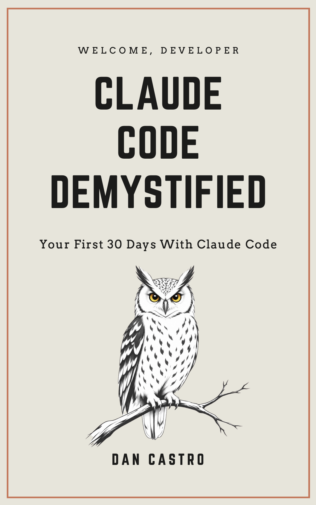

<p align="center">
  
</p>

# Claude Code Demystified: Examples

The companion code for the ebook *Claude Code Demystified*. Everything
here is a standalone project that sits next to, not inside, the
[Northbound](https://github.com/danilocastronz/northbound) codebase. Each
folder is the finished result of one part of the book, so you can compare
your own work against a working version.

There is a single branch, `main`. Nothing here changes per chapter.

| Folder | Chapters | What it is |
|---|---|---|
| [`northbound-toolkit/`](northbound-toolkit/) | 10 | A Claude Code plugin that bundles the `add-carrier-integration` skill from chapter 9. |
| [`northbound-api-experiments/`](northbound-api-experiments/) | 13-15 | Python scripts calling the Anthropic API: a first request, a structured prompt, and tool use. |
| [`northbound-assistant/`](northbound-assistant/) | 16 | The capstone: a command line assistant that drafts replies to support tickets. |

The plugin marketplace manifest for the toolkit lives at
[`.claude-plugin/marketplace.json`](.claude-plugin/marketplace.json).

## Running the Python projects

Each Python folder is self-contained. Python 3.9 or later.

```bash
cd northbound-api-experiments   # or northbound-assistant
python3 -m venv venv
source venv/bin/activate
pip install -r requirements.txt
cp .env.example .env            # then add your real API key
```

`.env` is gitignored. Never commit your key.

## Trying the plugin

From a Claude Code session started in this repo's root:

```
/plugin marketplace add ./
/plugin install northbound-toolkit@northbound-marketplace
```

Or load it straight from the folder while inside your Northbound checkout:

```bash
claude --plugin-dir /path/to/claude-code-demystified-examples/northbound-toolkit
```

## License

MIT. See [LICENSE](LICENSE).
